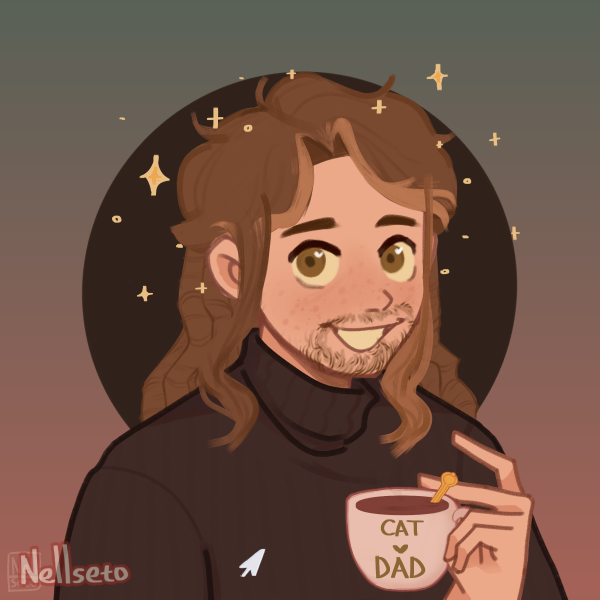

<div> 
    <a href="https://git.io/typing-svg"></a>
    <p style="font-size:20px" align="center"> My name is <strong>Renato Longo.</strong> </p>
</div>

<div> 



```javascript
const Me = {
    code: [Javascript, Typescript, SQL, Python, C++],
    tools: [Figma, Node, Sequelize, Express, React],
    about_me: ["I used to be a Math Student before I found my love in Web Development, I'm also a Data Science enthusiast."],
    softSkills: [Creativity, Team Working, Agile Thinking],
    loves: [music, code, tech, instruments]
};
if(need_developer){
    contactMe("renato.longo1406@gmail.com");
} else {
    invite("See my Portfolio");
};
```
</div>

##
<div>
<h3> Technologies </h3>


</div>


<div> 
<h3>Contact me</h3>
<a href = "mailto:renato.longo1406@gmail.com">

</a>
<a href = "https://www.linkedin.com/in/renato-longo-filho-6042a3219">

</a>
<a href = "https://portfolio-azzypog.vercel.app">

</a>
</div>

##


